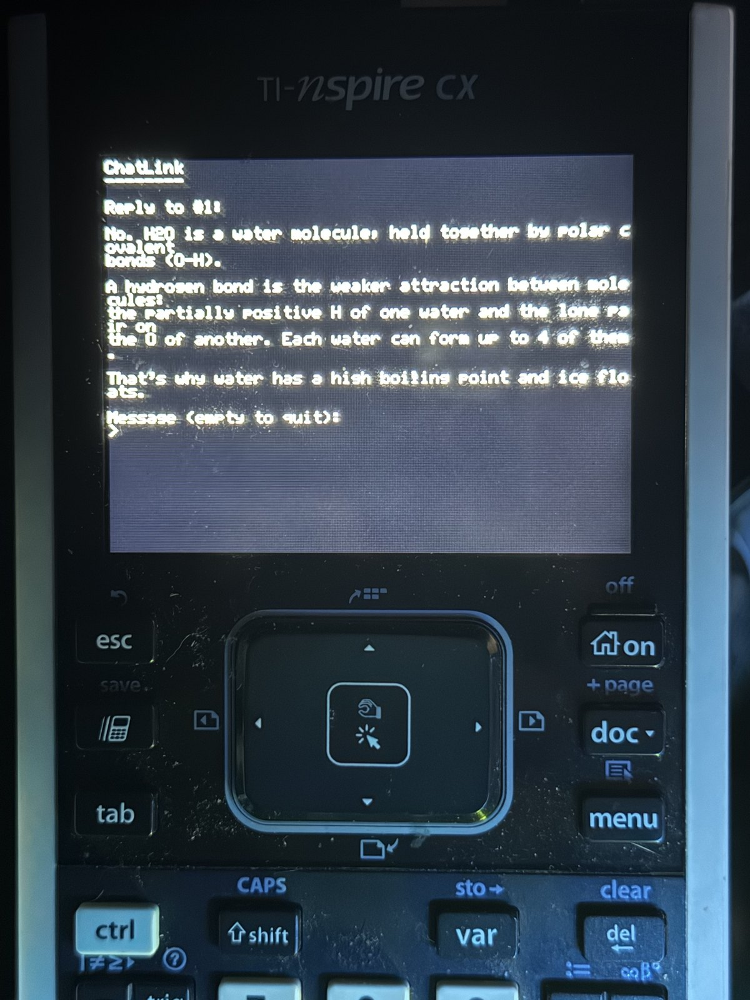
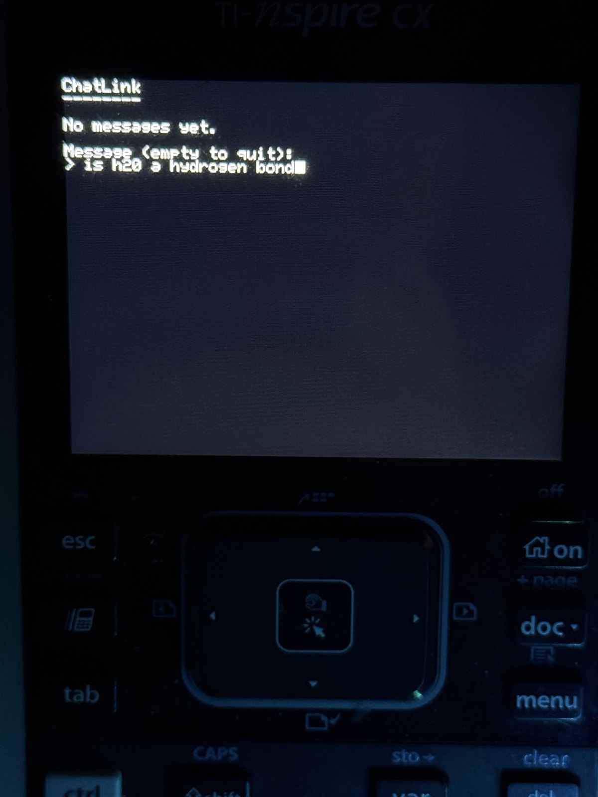
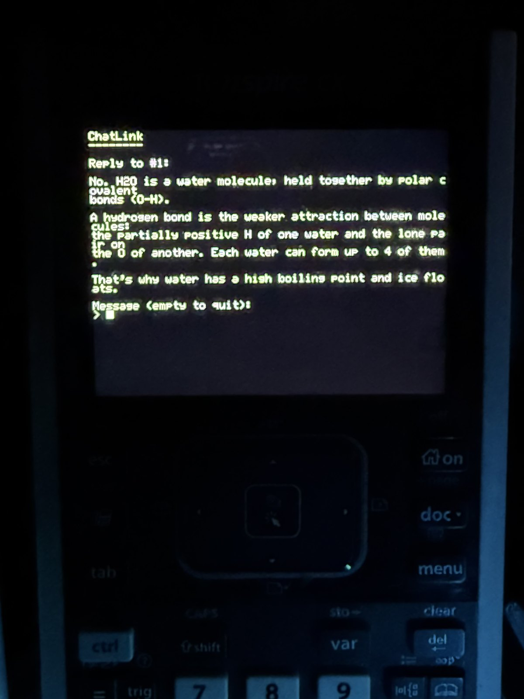

# ChatLink

**By [Christopher Willett](https://AnvilDevelopment.US) — [AnvilDevelopment.US](https://AnvilDevelopment.US)**

[](LICENSE)
[]()
[]()
[](#no-drivers-no-admin-no-system-changes)

Links a TI-Nspire CX to a PC over USB so text typed on the calculator reaches a
model, and so the calculator can drive the PC's own keyboard and mouse.

Working end to end: you type a question on the calculator, it appears on the PC,
Claude answers it, and the reply comes back to the calculator screen.

<p align="center">
  
</p>
<p align="center">
  <em>A stock TI-Nspire CX. Question typed on the calculator, answered by
  Claude, displayed on its own screen.</em>
</p>

It's up here as **security research**: an exam-permitted calculator turns into a
networked terminal for a general-purpose model, with nothing but a cable and
public software. See [Why this is public](#why-this-is-public).

**No driver installation. No administrator rights. No certificates added to your
trust store.** See [below](#no-drivers-no-admin-no-system-changes) for why that
took deliberate work, and why every other project tells you otherwise.

## Why this is public

I was sitting in class one day and we were discussing permitted calculators.
Even years ago with the Nspire it was too easy to cheat, you could just upload
your notes to it. But now if you just act like you're charging it, you never
have to study again.

**That's why this is up here: as research, and to show how easy cheating with a
modern calculator has gotten.**

The TI-Nspire CX is allowed in exams everywhere. SAT, ACT, AP, IB, plenty of
university finals. That rule assumes the thing on the desk is a calculator:
self-contained, and about as capable as it looks. None of that holds anymore.

What it actually took:

* An unmodified calculator and the cable it came with. Nothing soldered,
  nothing hidden, nothing bought off a grey market.
* No admin rights, no driver install, no config changes anywhere. It runs on a
  locked-down PC as a normal user.
* Stock TI OS. It boots normally, does maths normally, and looks fine if someone
  picks it up. It talks over TI's own signed driver, so there's no odd driver to
  spot either. And a calculator on the end of a USB cable just looks like a
  calculator charging.
* The program runs for under a second per turn and quits, so the calculator is
  just sitting there whenever anyone looks at it. Two text files left behind,
  deleted like any other document.
* A weekend. Ndless is a public project and the USB protocol was already
  reverse engineered.

The part that used to be hard was getting a model involved at all. That's now
one HTTPS request. The only real work left was fitting the answer onto a 53x30
character screen.

**"Calculators are allowed" is a rule written for a device that doesn't exist
anymore.** If you run exams, assume a permitted graphing calculator is a
networked terminal, because with a cable and public software that's what it is.
Checking what it looks like doesn't work now. Checking what it does might: reset
it to a known state, block the USB ports, or hand out your own hardware.

### On using it

Yes, you could cheat with this. Don't.

I put it up because saying "calculators are a problem now" doesn't land. People
nod and move on. A working thing you can read the source of is harder to ignore,
and none of the pieces were secret to begin with.

If you use it in a real exam and get caught, that's on you. Most schools call it
academic misconduct and it goes badly. Use it on your own calculator.

## No drivers, no admin, no system changes

**ChatLink requires no administrator rights and installs nothing on the
system.** It talks to the calculator through TI's own driver, `tinspusb.sys`,
which is already present on any machine where the calculator has been plugged
in once.

This was a deliberate choice, not a convenience. Every other Nspire project
tells you to rebind the device to **WinUSB** using Zadig, because that is what
*libusb* needs. That route costs a great deal:

* **Security.** Rebinding a device is an administrator driver install. Zadig
  goes further: it generates a driver package, creates a **self-signed
  certificate, and installs that certificate into your Trusted Root store** so
  Windows will accept it. That certificate outlives the install and will
  validate anything else signed with it. Handing that to a downloaded binary is
  a real and permanent expansion of what your machine trusts.
* **Portability.** A WinUSB rebind is machine-specific state. Move to another PC
  and you repeat the whole ritual, with admin rights you may not have. Using the
  driver that ships with TI's own software means ChatLink runs anywhere the
  calculator already works.
* **Collateral damage.** While WinUSB is bound, TI's own software stops seeing
  the calculator until you manually restore the original driver.
* **It can simply be refused.** On a machine with Code Integrity enforced, an
  unsigned driver package is rejected outright:
  `Driver package does not contain a catalog file, and Code Integrity is
  enforced` - no override, no "install anyway".

None of that is necessary. TI's driver is derived from the OSR USB WDM sample:
it publishes a device interface, `{c5b7f228-caff-42d5-a472-6b9eda7982ec}`, whose
dispatch routines map plain `ReadFile` and `WriteFile` onto the bulk IN and OUT
endpoints. That is exactly the surface the NavNet protocol needs. Opening it
requires no elevation - it works as a normal user.

So ChatLink:

* installs no driver, and changes no driver binding
* adds no certificate to any trust store
* needs no administrator rights at any point
* leaves TI's own software working normally
* keeps working after a reboot, on any machine, with no setup

The only thing it needs is a calculator that Windows already recognises as
`TI-Nspire(TM) Handheld Device`.

### The libusb backend is still there, and still optional

`NSPIRE_USB_BACKEND` selects the transport:

| Value | Transport | Requirements |
|---|---|---|
| `ti` *(default)* | TI's `tinspusb.sys` via `CreateFile` + overlapped I/O | none |
| `libusb` | upstream libusb backend | WinUSB rebind, admin driver install |

The vendored libusb only builds when the `libusb` backend is selected.
`driver/ChatLink_WinUSB.inf` exists only for that path; it is not needed, and
installing it requires a signed catalog this project does not ship.

## How the link works

The Nspire is not a mass-storage or HID device. Over USB it speaks a
vendor-specific bulk protocol (TI's "NavNet"), `VID 0x0451`, `PID 0xe012` (CX)
or `0xe022` (CX II). That protocol has no keystroke stream. Its useful
primitives are filesystem operations and screen capture.

So the channel is built on **files**. A program on the calculator writes what you
type into `req.tns`; the PC polls it over USB, answers, and writes `rsp.tns`.

Over NavNet the filesystem root **is** the documents folder - `ls /` lists what
the calculator shows on its home screen. There is no `/documents` prefix from
the PC side. Code running *on* the calculator does see `/documents/...`.

### One turn per launch

The calculator program writes its request and **exits immediately**. You relaunch
it to read the reply.

That is not a simplification, it is required. A resident Ndless program blocks
the USB link: `idle()` and `msleep()` mask every IRQ except the timer, and
`wait_key_pressed()` spins on `idle()`. Observed repeatedly - the PC could only
read `req.tns` after the calculator program was escaped. An earlier version
polled for the reply on-device and was indistinguishable from a hang, because it
sat for minutes with nothing on screen while starving the very link that would
have delivered the answer.

Exiting between turns keeps the calculator idle exactly when the PC needs it,
and the program can never appear frozen. The cost is one relaunch per turn.

### Framing

```
CHATLINK/1 <seq> <byte-length>\n<payload>
```

The sequence number makes repeated polls idempotent; the byte length lets a
reader detect a half-written file instead of consuming a truncated message.
Covered by 19 tests in `build/bin/chatlink_tests.exe`, including every truncated
prefix of a message and stale trailing bytes from a longer previous message.

## What it looks like

<table>
<tr>
<td width="50%"></td>
<td width="50%"></td>
</tr>
<tr>
<td><em>Asking. The console is drawn by ChatLink, not the OS - the stock input
dialog gets interrupted by a Document Settings popup on OS 4.2.</em></td>
<td><em>The answer, sized for a 53x30 character screen by the system prompt.</em></td>
</tr>
</table>

## Requirements

* A TI-Nspire CX with **Ndless** installed (see below)
* Windows, with the calculator recognised by TI's driver
* CLion, for its bundled CMake/Ninja/MinGW toolchain
* Docker, only to *build* the calculator-side program
* `ANTHROPIC_API_KEY`, only to run the model backend

## Building

CLion bundles CMake, Ninja and MinGW-w64 but does not put them on `PATH`, and
`gcc` needs its own `bin` directory on `PATH` to find `as` and `ld`:

```sh
tools/build.sh            # Debug
tools/build.sh Release
```

Output lands in `build/bin/`. The MinGW runtime is statically linked, so
`ChatLink.exe` runs outside the IDE; only `libnspire.dll` sits beside it.

## Ndless

Installed with **Ndless 4.2 r2006** ("For OS 4.2.0 on CX and CX CAS"). Both
`ndless_installer_4.2.0_cx.tns` and `ndless_resources.tns` go in a top-level
`ndless` folder - transferable with ChatLink's own `push`, so no TI software is
needed at any point.

Run `ChatLink probe` to read your OS version and check it against the Ndless
release notes before installing.

**Ndless does not survive a reboot or reset.** Re-run the installer afterwards.

## The calculator program

`calc/chatlink.c`, built with `calc/build.sh` inside the SDK container.

It uses an **nspireio console** for input rather than the OS's
`show_msg_user_input`, because on OS 4.2 that dialog is interrupted by a
Document Settings popup mid-typing. nspireio draws through `lcd_init`/`lcd_blit`
- the modern API - so it needs no LCD compatibility mode and does not corrupt
the display on HW-W hardware.

Pass `--uses-lcd-blit true` to genzehn (build.sh does). Left at the default,
the loader assumes the legacy framebuffer and switches the LCD into
compatibility mode, which scrambles the screen for programs that only use OS
drawing.

### The toolchain must be built from source

`ndless-sdk/toolchain/build_toolchain.sh` builds a **patched newlib** configured
for the calculator (`--disable-newlib-supplied-syscalls`, `MALLOC_PROVIDED`,
`ABORT_PROVIDED`, and a `PATH_MAX` a stock newlib lacks). Roughly 40 minutes.

**Do not substitute a stock `arm-none-eabi` toolchain.** It looks like it works:
`nspire-gcc` is a thin shim over a standard compiler, and file I/O comes from OS
syscalls rather than newlib, so it compiles, links and packages with no errors -
and produces a binary that crashes the calculator before `main` runs. The tell is
in the Zehn header: **1 relocation instead of 45**. `calc/build.sh` prints the
relocation count as a sanity check.

(`ld.gold` is a red herring. `nspire-gcc` passes `-fuse-ld=gold`, but no Ndless
toolchain builds gold; it silently falls back to `ld.bfd`.)

Building it needs care about resources - see Known issues.

## Usage

```
Link commands:
  probe                     Device info and connection state
  ls <path>                 List a directory; root IS documents, so 'ls /'
  pull <remote> <local>     Copy a file off the calculator
  push <local> <remote>     Copy a file onto the calculator
  rm / mkdir / rmdir        File and directory management
  shot <local.pgm>          Capture the calculator screen (see Known issues)

Bridge:
  serve [--once] [--echo]   Answer requests from chatlink.tns using the Claude
                            API. --echo replies without a model, --once exits
                            after one reply.

Input commands (drive this PC):
  type <text>               Type text into the focused window
  key <spec>                Send a chord, e.g. key ctrl+shift+t
```

Typical session:

1. `ChatLink serve` on the PC
2. Run `chatlink.tns`, type a message, Enter - it exits by itself
3. Run `chatlink.tns` again a few seconds later; the reply is at the top

> Running link commands from Git Bash needs `MSYS_NO_PATHCONV=1`, or it rewrites
> `/` into a Windows path before ChatLink sees it. cmd and PowerShell are
> unaffected.

## The model backend

`src/model/anthropic.cpp` calls the Messages API over **WinHTTP**, which ships
with the toolchain - no libcurl, no OpenSSL, nothing extra to build.

* `claude-opus-5`, effort `low` - suits short-answer chat and keeps the round
  trip quick when someone is waiting at a calculator
* `max_tokens: 1024` - deliberately small; replies must fit 53x30 characters
* A system prompt asking for plain ASCII under 120 words, no markdown, short
  lines - the console has no markdown renderer and very little room
* Server-side refusal fallbacks (`fallbacks: "default"`), the recommended
  default for Opus 5
* The USB device is **closed for the whole API call**. TI's driver allows a
  single opener, so holding it while waiting on the network would block the
  calculator.

Errors are returned *as the reply* as well as logged, because the calculator has
no other channel to learn what went wrong.

Set `ANTHROPIC_API_KEY` in the environment. `serve --echo` needs no key and is
useful for testing the link alone.

## `os_input`

A standalone Win32 `SendInput` wrapper: types UTF-8 as Unicode codepoints
(layout-independent, handles non-ASCII), sends modifier chords atomically, moves
and clicks the mouse, parses specs like `ctrl+shift+t`, and has a `--dry-run`
mode. It knows nothing about calculators or USB, so both the model bridge and a
future macropad mode can use it.

Windows blocks synthetic input into windows running at a higher integrity level;
ChatLink reports that rather than silently doing nothing.

## Known issues

**Large reads intermittently time out.** Pulling a ~200 KB file fails partway
roughly a third to a half of the time; a fresh connection on the same file
succeeds. Small operations are reliable. Draining the IN endpoint on open (see
`usb_ti.c`) helped but did not eliminate it. `pull` works around it by retrying
with a new connection. Writes have not shown the problem.

**`serve` and manual commands fight over the link.** TI's driver allows one
opener and `serve` polls every 700ms, so `push`/`ls`/`pull` will fail while it
runs. Stop `serve` first.

**`shot` returns a scrambled image on the CX.** The transfer is fine - repeated
captures are byte-identical and the payload is exactly 320x240x2 - but the
decoded framebuffer has no row structure at any stride while still compressing
to ~9%, so it is real data decoded wrongly. Ruled out: short reads desyncing
libnspire's screenshot loop; the payload being uncompressed; and inverted
PackBits branches (swapping them is worse). Most likely libnspire predates the
HW-W hardware revision. Not on the critical path.

**`mkdir /ndless` reports "Already exists" while `ls /ndless` reports "Path does
not exist".** Creating it as `/ndless/` - with a trailing slash - works, and it
then lists and accepts writes normally. Other names behave correctly without the
slash.

**Building the toolchain is resource-hungry.** It needs ~10 GB of scratch space
and real memory. On a 16 GB machine with no `.wslconfig`, WSL2 defaults to 8 GB
plus a 4 GB swap file **on C:** - a parallel GCC build then exhausts a
near-full system drive and can take Windows down. Cap it first:

```ini
# %UserProfile%\.wslconfig
[wsl2]
memory=6GB
processors=6
swap=2GB
swapFile=D:\DockerData\wsl-swap.vhdx
```

and keep Docker's disk image off a full drive. `-j6` on 6 vCPUs is a reasonable
build parallelism; memory, not CPU, is the binding constraint.

## Layout

```
src/
  os_input/     Win32 SendInput wrapper. No calculator or USB knowledge.
  link/         C++ wrapper over libnspire, plus protocol.{h,cpp} framing
  model/        Claude API client over WinHTTP
  tests/        Hardware-free tests for framing and key-spec parsing
  main.cpp      CLI
calc/
  chatlink.c    Calculator program (one turn per launch)
  linktest.c    Toolchain and file-I/O validation, staged
  build.sh      Builds a .tns inside the SDK container
third_party/
  libnspire/    NavNet protocol (LGPL-3.0), plus ChatLink's TI-driver transport
  libusb/       Only used by the optional 'libusb' transport
driver/         WinUSB .inf, only for the libusb backend
tools/build.sh  Builds the PC side using CLion's bundled toolchain
```

## Author

**Christopher Willett** — [AnvilDevelopment.US](https://AnvilDevelopment.US)

Built this for fun, put it up as research. If you run exams and want to talk
about what it means for your rules, get in touch. That's the point of it being
public.

Contributions are welcome. Please keep the two rules this project is built on:

1. **No administrator rights, ever.** If a change needs elevation, a driver
   install, or anything added to a certificate store, it does not belong here —
   that constraint is the point of the project, not an incidental detail.
2. **Explain the non-obvious in the code.** Much of this codebase encodes hard-won
   findings — a resident Ndless program starves the USB link, a stock ARM
   toolchain silently produces a binary with 1 relocation instead of 45, TI's
   driver allows a single opener. Those comments cost real hardware crashes to
   learn. Keep them with the code they explain.

## Licence

Copyright (C) 2026 Christopher Willett / AnvilDevelopment.US

ChatLink is free software, licensed under the **GNU General Public License,
version 3 or later**. See [LICENSE](LICENSE) for the full text.

GPL-3.0 was chosen deliberately. ChatLink links **libnspire**, whose licensing
is self-contradictory: the repository declares LGPL-3.0 and ships
`COPYING.LESSER`, but every one of its source headers grants the plain **GNU
General Public License**, with no file mentioning the Lesser variant. Under the
LGPL reading a permissive licence would be fine; under the GPL reading it would
not. GPL-3.0 is correct either way, so the release cannot be wrong about it.

## Third-party licences

* **libnspire** - `third_party/libnspire/COPYING` (GPL-3.0) and
  `COPYING.LESSER` (LGPL-3.0); see the Licence section above on the ambiguity.
  Built as a **shared** library so it stays replaceable either way.
* **libusb** - LGPL-2.1, `third_party/libusb/COPYING`. Only built for the
  optional `libusb` transport.
* **Ndless** and its SDK - MPL-1.1. Not redistributed here; fetched at build
  time into the SDK container.

Local changes to libnspire:

* `chatlink-mingw.patch` - upstream tests `_WIN32` where it means `_MSC_VER`,
  sending MinGW down an MSVC-only path.
* `src/usb_ti.c` - the TI-driver transport. `src/usb.h` made backend-agnostic
  with `extern "C"` guards; `src/cx2.cpp` routed through the same `usb_bulk`
  shim so the CX II path is not tied to libusb.
* `src/init.c` - the handshake waits for one unsolicited "address request" the
  calculator emits on connect, then discards it; its only purpose is to drain
  that packet. The libusb backend called `libusb_reset_device()`, forcing a
  re-enumeration and a fresh request every open. TI's driver performs no reset,
  so from the second connection onward the packet is already consumed. The wait
  now treats a timeout as "already drained" rather than failing.
